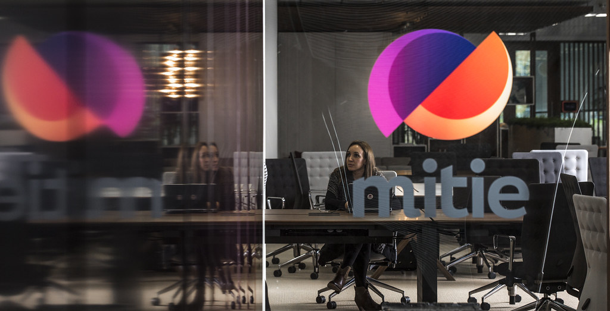

## Recent updates

### Slaughter and May advises Interserve on proposed merger of Interserve Support Services with Mitie

25 June 2020

Slaughter and May is advising Interserve Group Limited on the proposed merger of Interserve Support Services with Mitie Group PLC. 

Both Interserve and Mitie are leading players in the UK facilities management outsourcing industry and the combination of the two will create the largest facilities management company in the UK. 

#### What is the transaction conditional upon?
1. Mitie shareholder approval as a Class 1 transaction
2. CMA approval

#### Why have Interserve and Mitie decided to merge?
As leaders of the UK FM outsourcing industry, the combined organisation will be uniquely placed in the UK market to deliver best in class, market-leading services to customers. Interserve's expertise in delivering frontline critical public services together with Mitie's pedigree in delivering  technical and business services to the private sector will  enable the merger to share best practice, innovation and technology to the benefit of their combined extensive customer portfolio. 

As believed by the Board of Interserve Group Ltd, this transaction would create a larger, stronger UK FM business, making it highly attractive to its **stakeholders**, including its employees, customers, partners and shareholders.

